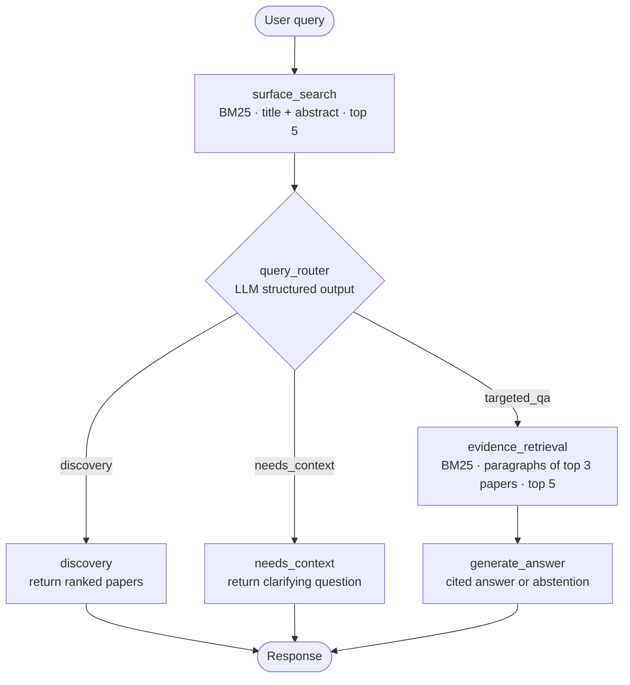

# PaperRAG

An agentic retrieval-augmented question answering system over NLP research papers, built on the [QASPER](https://huggingface.co/datasets/allenai/qasper) corpus.

Unlike a standard RAG demo, PaperRAG treats QASPER as an **open-domain** task: the paper is not given to the system. A query first has to find the right paper among all of them, then find the right paragraphs inside it, and only then produce a cited answer — or refuse to answer when the evidence does not support one.


---

## What it does

| Capability | How |
| --- | --- |
| **Two-stage retrieval** | BM25 over `title + abstract` to find papers, then a second BM25 index built on the fly over the paragraphs of the top-ranked papers |
| **Intent routing** | An LLM router classifies each query as `discovery`, `targeted_qa`, or `needs_context` and returns a confidence score and a reason |
| **Grounded generation** | Answers are produced only from retrieved passages, with paragraph-level citations |
| **Citation validation** | Cited paragraph IDs are checked against the actually retrieved evidence; hallucinated IDs are dropped |
| **Explicit abstention** | The system returns `abstained: true` with a reason when evidence is missing, insufficient, or uncitable |
| **Evaluation harness** | Retrieval, answer, and abstention metrics plus JSONL query logging, built before the retriever so every change is measurable |

### The three routes

- **`discovery`** — a broad topic query (`"multilingual RAG evaluation"`). Returns ranked papers, no generated answer.
- **`targeted_qa`** — a specific, self-contained question (`"What evaluation metrics are used in the QASPER paper?"`). Runs evidence retrieval and answer generation.
- **`needs_context`** — a question with an unresolved referent (`"What dataset did they use?"`). Returns a clarifying question instead of guessing.

This third route exists because a large share of QASPER questions were written by annotators who could see the paper, so they are not answerable open-domain as written. Routing them out is treated as correct behaviour rather than a failure.

---

## Architecture

The agent is a [LangGraph](https://github.com/langchain-ai/langgraph) `StateGraph`:



Shared state is a `TypedDict` (`src/agent/state.py`) carrying the query, paper candidates, route decision, evidence passages, answer, citations, and abstention flags.

Routing runs *after* surface search, so the router sees the retrieved titles and abstracts as extra signal — but its prompt explicitly instructs it not to let noisy retrieval override linguistic evidence in the query itself.

---

## Repository layout

```
src/
├── config.py                   # Paths, seeds, default top-k
├── api/
│   └── main.py                 # FastAPI service (/health, /search)
├── agent/
│   ├── graph.py                # LangGraph wiring
│   ├── state.py                # PaperRAGState schema
│   ├── nodes.py                # surface_search, evidence_retrieval, discovery, needs_context
│   ├── router.py               # Intent classification with structured output
│   └── generator.py            # Cited answer generation + citation validation
├── retrieval/
│   ├── bm25_engine.py          # Reusable BM25Okapi retriever class
│   ├── paper_bm25.py           # Paper-level index (title + abstract)
│   ├── evidence_bm25.py        # Paragraph-level index
│   └── bm25.py                 # Offline BM25 baseline + metrics CLI
├── evaluation/
│   ├── metrics.py              # Retrieval, answer, and abstention metrics
│   └── query_log.py            # QueryLogRecord + JSONL read/write
├── data/
│   ├── prepare_qasper.py       # Flatten QASPER into paragraph/question tables
│   ├── question_audit.py       # Sample questions for manual validity labelling
│   └── ai_label_audit.py       # LLM-assisted labelling of the same sample
└── pipelines/
    └── run_phases_1_to_5.py    # End-to-end runner for the offline phases

frontend/                       # Streamlit UI for the deployed API
test/                           # Retrieval and metric tests
```

---

## Quickstart

### Requirements

Python 3.12 (see `.python-version`) and an OpenAI API key.

```bash
git clone https://github.com/ybai1110/PaperRAG.git
cd PaperRAG

python -m venv .venv
source .venv/bin/activate        # Windows: .venv\Scripts\activate

pip install -r requirements.txt
```

The offline data and evaluation scripts additionally require `pandas`, and the test suite requires `pytest`.

### Environment

Create a `.env` file in the repository root:

```bash
OPENAI_API_KEY=sk-...
OPENAI_MODEL=gpt-4o-mini
```

`.env` is gitignored. Never place the API key in the Streamlit frontend — it belongs only in the backend environment.

### Run the API

```bash
uvicorn src.api.main:app --reload --port 8000
```

On startup the service loads the QASPER train split, builds the paper-level BM25 index, and compiles the agent graph. This takes a moment; `/health` reports `graph_ready` so you can tell when it is finished.

```bash
curl http://localhost:8000/health
# {"status":"ok","graph_ready":true}
```

### Run the UI

```bash
pip install streamlit requests
export PIPELINE_API_URL=http://localhost:8000
streamlit run frontend/app.py
```

Without `PIPELINE_API_URL` the app points at the hosted backend. See `frontend/README.md` for Streamlit Community Cloud deployment.

---

## API

### `GET /health`

```json
{ "status": "ok", "graph_ready": true }
```

### `POST /search`

```json
{ "query": "What evaluation metrics are used in the QASPER paper?" }
```

Query length is validated at 2–1000 characters. Returns `503` while the graph is still loading.

```json
{
  "query": "What evaluation metrics are used in the QASPER paper?",
  "route": "targeted_qa",
  "route_confidence": 0.93,
  "route_reason": "Specific question with an identifiable paper name.",
  "results": [
    {
      "paper_id": "1911.03072",
      "rank": 1,
      "title": "A Dataset of Information-Seeking Questions and Answers Anchored in Research Papers",
      "abstract": "...",
      "score": 21.47
    }
  ],
  "evidence": [
    {
      "paragraph_id": "1911.03072_s4_p2",
      "paper_id": "1911.03072",
      "title": "...",
      "section": "Evaluation",
      "text": "...",
      "rank": 1,
      "score": 14.02
    }
  ],
  "answer": "...",
  "citations": [
    {
      "paragraph_id": "1911.03072_s4_p2",
      "paper_id": "1911.03072",
      "title": "...",
      "section": "Evaluation",
      "passage": "..."
    }
  ],
  "clarification": null,
  "abstained": false,
  "abstention_reason": ""
}
```

Which fields are populated depends on the route: `discovery` returns papers with a null answer, `needs_context` returns a `clarification` question, and `targeted_qa` returns an answer with citations or an abstention.

---

## Offline pipeline

The offline side exists so that retrieval quality is measured rather than assumed.

**1 — Prepare the data.** Flattens all QASPER splits into a paragraph table and a question table, mapping each question's gold evidence spans back to stable paragraph IDs.

```bash
python -m src.data.prepare_qasper
# → data/processed/qasper_paragraphs.csv
# → data/processed/qasper_questions.csv
```

**2 — Audit question validity.** Samples questions with text evidence into a blank CSV for manual labelling as `standalone`, `repairable`, or `ambiguous`. `ai_label_audit.py` produces an independent LLM label on the same sample so human and model labels can be compared.

```bash
python -m src.data.question_audit create --sample-size 100
# fill in the question_validity column, then:
python -m src.data.question_audit summarize
```

**3 — Run the BM25 baseline.** Evaluates retrieval on the audited questions and writes a per-question JSONL log alongside aggregate metrics.

```bash
python -m src.retrieval.bm25 --top-k 10 --audit data/audits/question_audit.csv
# → results/logs/bm25_results.jsonl
# → results/metrics/bm25_metrics.json
```

Useful flags: `--question-validity` selects which audited category to score, `--question-column` switches between original and rewritten question text, `--split` and `--max-questions` restrict the evaluation set.

Or run the whole sequence, which pauses for the manual audit step:

```bash
python -m src.pipelines.run_phases_1_to_5
```

---

## Metrics

Defined in `src/evaluation/metrics.py`:

| Metric | Meaning |
| --- | --- |
| `paper_recall_at_k` | Did the gold paper appear in the top *k* results? |
| `evidence_precision_recall_f1` | Set overlap between gold and retrieved paragraph IDs |
| `max_answer_f1` | SQuAD-style token F1 against the best of several human gold answers |
| `abstention_precision_recall` | Were abstentions actually on unanswerable questions? |
| `grounded_answer_f1` | Answer F1 computed **only** when retrieval recovered at least one gold paragraph — separates generation quality from retrieval failure |

Every evaluated question is logged as a `QueryLogRecord` with gold and retrieved IDs, scores, latencies, and token counts, so failures can be traced back to a specific stage instead of inferred from an aggregate number.

The answer-normalisation logic is a starter implementation; for reported research numbers it should be checked against the official QASPER evaluation script.

---

## Tests

```bash
pytest test/test_evaluation.py
```

`test_evaluation.py` covers the metric functions. `test_bm25.py`, `test_retrieval.py`, and `test_evidence_bm25.py` are runnable scripts that load the real dataset and print retrieval output for manual inspection:

```bash
python -m test.test_bm25
```

---

## Design notes

**Evaluation before retrieval.** The metric and logging layers were written first, so every subsequent retrieval change could be compared against a fixed baseline instead of judged by eye.

**BM25 as the baseline, not the endpoint.** A transparent lexical baseline makes it possible to attribute later gains to a dense or hybrid retriever rather than to incidental changes in preprocessing.

**Abstention as a first-class outcome.** A system that answers every question confidently is easy to build and hard to trust. Abstentions and clarification requests are recorded and scored like any other prediction.

## Roadmap

- Dense and hybrid retrieval compared against the BM25 baseline on identical logs
- Distractor-corpus scaling: measuring how retrieval degrades as non-QASPER papers are added to the index
- Near-duplicate confusion analysis for topically adjacent papers
- Closed-book contamination control — how much the generator can answer with no evidence at all

## License

Not yet specified.
